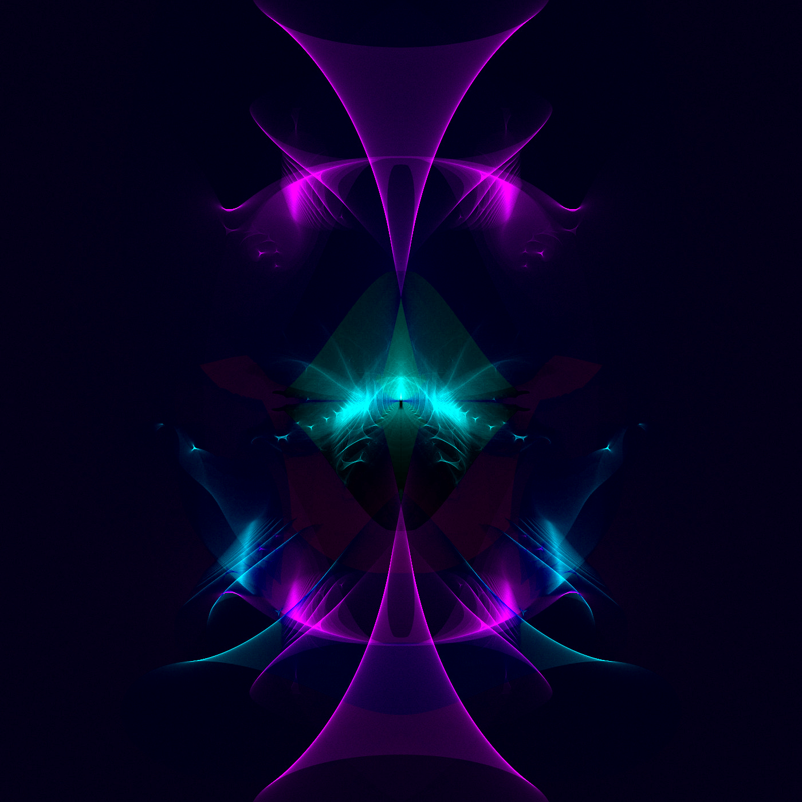

# Green Fractals

This application generates fractals using a variation of the Buddhabrot method discovered by Melinda Green.

Melinda's technique samples points in the complex plane, and then repeatedly applies the Mandelbrot equation to these points to see if they eventually land outside of an escape radius after a certain number of iterations.

An array of counters is used to track every point that is hit before a sample point escapes. The size of this array is chosen so that it will map directly to the pixels in the image that is being produced. Every time a point lands within the small area associated with a particular pixel it is incremented by one.

After a large number of points have been tested, this array of counters is used as a heat map to produce the image. Each count is divided by the largest value in the counters array, so that the largest value has a value of 1. This will be the brightest pixel in the image. All other pixels will have a brightness value somewhere between 0 and 1.

Here is Melinda's page describing the process and displaying a number of examples: 

[The Buddhabrot Technique](http://superliminal.com/fractals/bbrot/bbrot.htm)

This application expands her original technique. It allows for a wide variety of generating functions, rather than just the traditional Mandelbrot generator. Each term also has a coefficient applied to it, and at each step in the process the previous value is conjugated before applying the equation again. This significantly changes the character of the images produced.

Here is an example of a generating function:

w = conjugate(z)

z = pw3 + qw2 + rw + C

`C` is the sample point for each test, which is chosen at random from points within the desired complex range. 

This produces a generalized fractal based on the method developed by Green. I have called the range of fractals generated using this expanded method: Green Fractals.

The application is also set up to produce a series of these fractals, which can be combined together to create animations. The general approach is to treat the coefficients of the generating function as a vector <p, q, r>, and then transform this vector by small amounts to produce slight variations. This series of fractals can then be combined together to form a smooth animation.

Here is an example of the animations produced by this technique:

[Fractals in Motion](https://www.youtube.com/watch?v=NHzehXtsRbo)

# Contributions

This software is available under the [MIT Open Source License](https://github.com/ecssiah/green-fractals/blob/master/LICENSE.txt). Contributions to the project are welcome at https://github.com/ecssiah/green-fractals. I would also appreciate it if users shared the fractals and animations they generate using this technique. I can be contacted at ecssiah[AT]gmail.com.   
